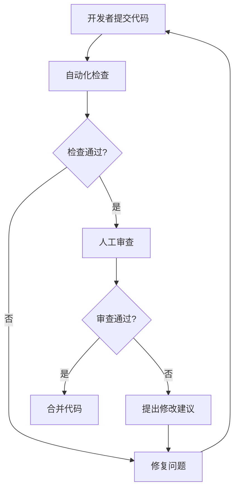

# 代码规范

代码规范是软件开发中的重要环节，良好的代码规范不仅能提高代码质量，还能提升团队协作效率。

## 🎯 学习目标

- 理解代码规范的重要性
- 掌握常见的代码规范标准
- 学会使用代码格式化工具
- 建立代码审查流程

## 📚 代码规范的重要性

### 为什么需要代码规范？

1. **提高可读性** - 统一的代码风格让代码更易理解
2. **降低维护成本** - 规范的代码更容易维护和修改
3. **减少Bug** - 规范的代码能减少潜在的错误
4. **提升团队效率** - 统一的规范让团队协作更顺畅
5. **便于代码审查** - 规范的代码更容易进行代码审查

## 🔧 常见代码规范

### 1. 命名规范

#### 变量和函数命名

```python
# Python命名规范
# 使用下划线分隔单词（snake_case）
user_name = "张三"
user_age = 25

def calculate_total_price(price, tax_rate):
    """计算总价格"""
    return price * (1 + tax_rate)

# 常量使用全大写
MAX_RETRY_COUNT = 3
DATABASE_URL = "mysql://localhost:3306/mydb"
```

```javascript
// JavaScript命名规范
// 变量和函数使用驼峰命名（camelCase）
let userName = "张三";
let userAge = 25;

function calculateTotalPrice(price, taxRate) {
    return price * (1 + taxRate);
}

// 常量使用全大写
const MAX_RETRY_COUNT = 3;
const DATABASE_URL = "mysql://localhost:3306/mydb";
```

#### 类命名

```python
# Python类命名使用PascalCase
class UserManager:
    def __init__(self):
        self.users = []
    
    def add_user(self, user):
        self.users.append(user)

class DatabaseConnection:
    def __init__(self, url):
        self.url = url
```

```javascript
// JavaScript类命名使用PascalCase
class UserManager {
    constructor() {
        this.users = [];
    }
    
    addUser(user) {
        this.users.push(user);
    }
}

class DatabaseConnection {
    constructor(url) {
        this.url = url;
    }
}
```

### 2. 注释规范

#### 函数注释

```python
def calculate_discount(price, discount_rate, is_member=False):
    """
    计算商品折扣价格
    
    Args:
        price (float): 商品原价
        discount_rate (float): 折扣率 (0-1之间)
        is_member (bool): 是否为会员，默认False
    
    Returns:
        float: 折扣后的价格
    
    Raises:
        ValueError: 当折扣率不在0-1之间时抛出异常
    
    Example:
        >>> calculate_discount(100, 0.1, True)
        90.0
    """
    if not 0 <= discount_rate <= 1:
        raise ValueError("折扣率必须在0-1之间")
    
    base_discount = price * discount_rate
    member_bonus = price * 0.05 if is_member else 0
    
    return price - base_discount - member_bonus
```

```javascript
/**
 * 计算商品折扣价格
 * @param {number} price - 商品原价
 * @param {number} discountRate - 折扣率 (0-1之间)
 * @param {boolean} isMember - 是否为会员，默认false
 * @returns {number} 折扣后的价格
 * @throws {Error} 当折扣率不在0-1之间时抛出异常
 * @example
 * calculateDiscount(100, 0.1, true) // 返回 90
 */
function calculateDiscount(price, discountRate, isMember = false) {
    if (discountRate < 0 || discountRate > 1) {
        throw new Error("折扣率必须在0-1之间");
    }
    
    const baseDiscount = price * discountRate;
    const memberBonus = isMember ? price * 0.05 : 0;
    
    return price - baseDiscount - memberBonus;
}
```

### 3. 代码结构规范

#### 文件组织

```python
# 文件头部注释
"""
用户管理模块

提供用户相关的业务逻辑处理
包括用户注册、登录、信息更新等功能

Author: 张三
Date: 2024-01-01
Version: 1.0.0
"""

# 导入标准库
import os
import sys
from datetime import datetime

# 导入第三方库
import requests
from sqlalchemy import create_engine

# 导入本地模块
from .models import User
from .utils import validate_email

# 常量定义
DEFAULT_PAGE_SIZE = 20
MAX_LOGIN_ATTEMPTS = 3

# 类定义
class UserService:
    """用户服务类"""
    
    def __init__(self, db_connection):
        self.db = db_connection
    
    def create_user(self, user_data):
        """创建用户"""
        # 实现逻辑
        pass

# 函数定义
def send_welcome_email(user_email):
    """发送欢迎邮件"""
    # 实现逻辑
    pass

# 主程序入口
if __name__ == "__main__":
    # 主程序逻辑
    pass
```

### 4. 错误处理规范

```python
def process_user_data(user_data):
    """处理用户数据"""
    try:
        # 数据验证
        if not user_data:
            raise ValueError("用户数据不能为空")
        
        if not isinstance(user_data, dict):
            raise TypeError("用户数据必须是字典类型")
        
        # 业务逻辑处理
        result = validate_and_save_user(user_data)
        return result
        
    except ValueError as e:
        logger.error(f"数据验证失败: {e}")
        raise
    except TypeError as e:
        logger.error(f"数据类型错误: {e}")
        raise
    except Exception as e:
        logger.error(f"处理用户数据时发生未知错误: {e}")
        raise
```

## 🛠️ 代码格式化工具

### 1. Python - Black

```bash
# 安装Black
pip install black

# 格式化单个文件
black myfile.py

# 格式化整个项目
black .

# 检查格式但不修改
black --check .
```

### 2. JavaScript - Prettier

```bash
# 安装Prettier
npm install --save-dev prettier

# 格式化文件
npx prettier --write "src/**/*.{js,jsx,ts,tsx,json,css,md}"

# 检查格式
npx prettier --check "src/**/*.{js,jsx,ts,tsx,json,css,md}"
```

### 3. 配置文件示例

#### .prettierrc (Prettier配置)

```json
{
  "semi": true,
  "trailingComma": "es5",
  "singleQuote": true,
  "printWidth": 80,
  "tabWidth": 2,
  "useTabs": false
}
```

#### pyproject.toml (Black配置)

```toml
[tool.black]
line-length = 88
target-version = ['py38']
include = '\.pyi?$'
extend-exclude = '''
/(
  # 排除的目录
  \.git
  \.mypy_cache
  \.tox
  \.venv
  _build
  buck-out
  build
  dist
)/
'''
```

## 🔍 代码审查规范

### 1. 审查清单

#### 功能性审查
- [ ] 代码是否实现了预期功能？
- [ ] 边界条件是否处理正确？
- [ ] 错误处理是否完善？
- [ ] 性能是否满足要求？

#### 代码质量审查
- [ ] 代码是否遵循团队规范？
- [ ] 变量和函数命名是否清晰？
- [ ] 注释是否充分且准确？
- [ ] 代码结构是否清晰？

#### 安全性审查
- [ ] 是否存在安全漏洞？
- [ ] 输入验证是否充分？
- [ ] 敏感信息是否泄露？
- [ ] 权限控制是否正确？

### 2. 审查流程



## 📖 最佳实践

### 1. 代码组织

```python
# 好的代码组织
class UserService:
    """用户服务类 - 职责单一"""
    
    def __init__(self, db_connection):
        self.db = db_connection
    
    def create_user(self, user_data):
        """创建用户 - 方法职责明确"""
        # 1. 数据验证
        self._validate_user_data(user_data)
        
        # 2. 业务逻辑处理
        user = self._process_user_data(user_data)
        
        # 3. 数据持久化
        return self._save_user(user)
    
    def _validate_user_data(self, data):
        """私有方法 - 数据验证"""
        pass
    
    def _process_user_data(self, data):
        """私有方法 - 数据处理"""
        pass
    
    def _save_user(self, user):
        """私有方法 - 数据保存"""
        pass
```

### 2. 错误处理

```python
# 好的错误处理
def get_user_by_id(user_id):
    """根据ID获取用户"""
    try:
        # 参数验证
        if not user_id:
            raise ValueError("用户ID不能为空")
        
        if not isinstance(user_id, (int, str)):
            raise TypeError("用户ID必须是整数或字符串")
        
        # 数据库查询
        user = database.get_user(user_id)
        
        if not user:
            raise UserNotFoundError(f"用户ID {user_id} 不存在")
        
        return user
        
    except (ValueError, TypeError) as e:
        logger.warning(f"参数错误: {e}")
        raise
    except UserNotFoundError as e:
        logger.info(f"用户不存在: {e}")
        raise
    except DatabaseError as e:
        logger.error(f"数据库查询失败: {e}")
        raise
    except Exception as e:
        logger.error(f"获取用户时发生未知错误: {e}")
        raise
```

## 🎥 视频教程

<VideoPlayer src="https://www.youtube.com/watch?v=dQw4w9WgXcQ" />

## 💡 学习建议

1. **建立规范意识** - 从开始就养成良好的编码习惯
2. **使用工具辅助** - 利用自动化工具保证代码规范
3. **团队协作** - 与团队保持一致的标准
4. **持续改进** - 根据项目需要调整规范
5. **代码审查** - 通过审查提升代码质量

## 🔄 下一步

掌握代码规范后，你可以：
- 学习更高级的编程技巧
- 了解设计模式和架构原则
- 开始学习业务开发流程
- 进入下一个学习阶段

准备好学习 [业务开发流程](./business-development) 了吗？

---

> 💡 **提示**: 代码规范不是限制，而是帮助。好的规范能让你的代码更专业、更易维护，也能让团队协作更高效。
